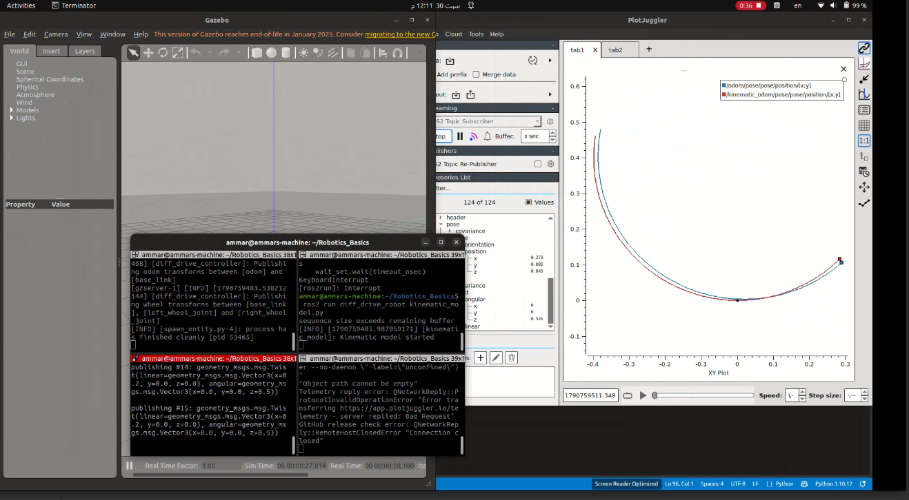

# Differential-Drive Robot: Gazebo vs. Kinematic Model

This package builds a differential-drive robot from Xacro, simulates it in
Gazebo, and compares its motion with an ideal kinematic model.  The two
models receive the same velocity command, making it possible to see the
effect of simulation dynamics on an otherwise identical trajectory.

## What is being compared?

| Model | Output topic | What it represents |
| --- | --- | --- |
| Gazebo simulation | `/odom` | The robot simulated with mass, inertia, contact, friction, and the Gazebo differential-drive plugin. |
| Kinematic model | `/kinematic_odom` | An ideal planar differential-drive model integrated from the commanded linear and angular velocity. |

You publish the command on `/cmd_vel` from a terminal. Gazebo consumes that
command directly, and `src/kinematic_model.py` subscribes to the same topic.
This keeps the input to both models consistent.

## 1. Build the robot with Xacro

`urdf/diff_drive_robot.xacro` is the top-level robot description. It defines:

- the rectangular `base_link` body;
- the left and right continuous wheel joints;
- wheel geometry: radius `0.10 m`, width `0.05 m`, and wheel separation
  `0.40 m`;
- a low-friction front support sphere; and
- mass and inertia for the body, wheels, and support sphere.

The file includes `urdf/gazebo.xacro`, which adds Gazebo-specific material,
contact, and controller-plugin settings. The launch file expands the Xacro to
URDF at runtime, starts Gazebo, publishes the robot state, and spawns the
robot at `z = 0.5 m`.

To inspect the generated URDF manually:

```bash
cd ~/Robotics_Basics
source /opt/ros/$ROS_DISTRO/setup.bash
source install/setup.bash
ros2 run xacro xacro src/diff_drive_robot/urdf/diff_drive_robot.xacro \
  > /tmp/diff_drive_robot.urdf
```

## 2. Tune the simulated dynamics

The physical behavior is configured in `urdf/gazebo.xacro`.

- The drive wheels use `mu1 = mu2 = 1.5`, providing traction in the contact
  directions.
- The front support sphere uses `mu1 = mu2 = 0.02`, so it supports the robot
  while introducing little resistance to turning.
- Contact stiffness and damping are set with `kp` and `kd`.
- The `gazebo_ros_diff_drive` plugin uses a `10.0 N·m` maximum wheel torque,
  `100.0 rad/s²` maximum wheel acceleration, and a `50 Hz` update rate.

These settings are deliberately part of the experiment: unlike the ideal
model, the Gazebo robot must respond through wheel contact, inertia, and the
plugin's actuator limits.

## 3. Kinematic model

The ideal model in `src/kinematic_model.py` maintains the planar state
`(x, y, theta)` and updates it every `0.02 s` (50 Hz):

```text
x_dot     = v cos(theta)
y_dot     = v sin(theta)
theta_dot = omega
```

It uses forward Euler integration and publishes the resulting pose and twist
as `nav_msgs/Odometry` on `/kinematic_odom`. It has no mass, slip, contact,
or motor dynamics: it assumes the commanded `v` and `omega` are achieved
immediately.

## 4. Build and run the experiment

In a terminal, build the workspace and start Gazebo:

```bash
cd ~/Robotics_Basics
source /opt/ros/$ROS_DISTRO/setup.bash
colcon build --packages-select diff_drive_robot
source install/setup.bash
ros2 launch diff_drive_robot gazebo.launch.py
```

Open two additional terminals. Source the workspace in each one, then run:

```bash
# Terminal 2: ideal kinematic odometry
ros2 run diff_drive_robot kinematic_model.py
```

```bash
# Terminal 3: publish the common velocity command
ros2 topic pub /cmd_vel geometry_msgs/msg/Twist \
  "{linear: {x: 0.2}, angular: {z: 0.5}}"
```

This command publishes a linear velocity of `0.2 m/s` and an angular velocity
of `0.5 rad/s`. Both models receive it through `/cmd_vel`.

## 5. Compare the topics in PlotJuggler

Start PlotJuggler and load the ROS 2 streaming data source:

```bash
plotjuggler
```

Plot these series together:

| Comparison | Gazebo | Kinematic model |
| --- | --- | --- |
| X position | `/odom/pose/pose/position/x` | `/kinematic_odom/pose/pose/position/x` |
| Y position | `/odom/pose/pose/position/y` | `/kinematic_odom/pose/pose/position/y` |
| Angular velocity | `/odom/twist/twist/angular/z` | `/kinematic_odom/twist/twist/angular/z` |

For a trajectory view, use an XY plot with `x` on the horizontal axis and
`y` on the vertical axis for each topic. Rename the curves to **Gazebo** and
**Kinematic** so the source of each trace is clear.

## Result and interpretation

The position traces are close because both models receive the same
`/cmd_vel` command and use the same differential-drive geometry. They do not
overlap perfectly because the Gazebo robot is dynamic while the kinematic
model is ideal.

In particular, the Gazebo angular-velocity trace shows small oscillations.
Those oscillations change the instantaneous heading; because position is
integrated using that heading, they accumulate into the slight difference
between the two position curves. The kinematic model does not show this
effect because it applies the requested angular velocity directly.

## PlotJuggler recording

[](media/plotjuggler_gazebo_vs_kinematic.webm)

The recording should show the X/Y position comparison and the angular
velocity plot together, making the connection between angular-velocity
oscillation and the small trajectory difference visible.
